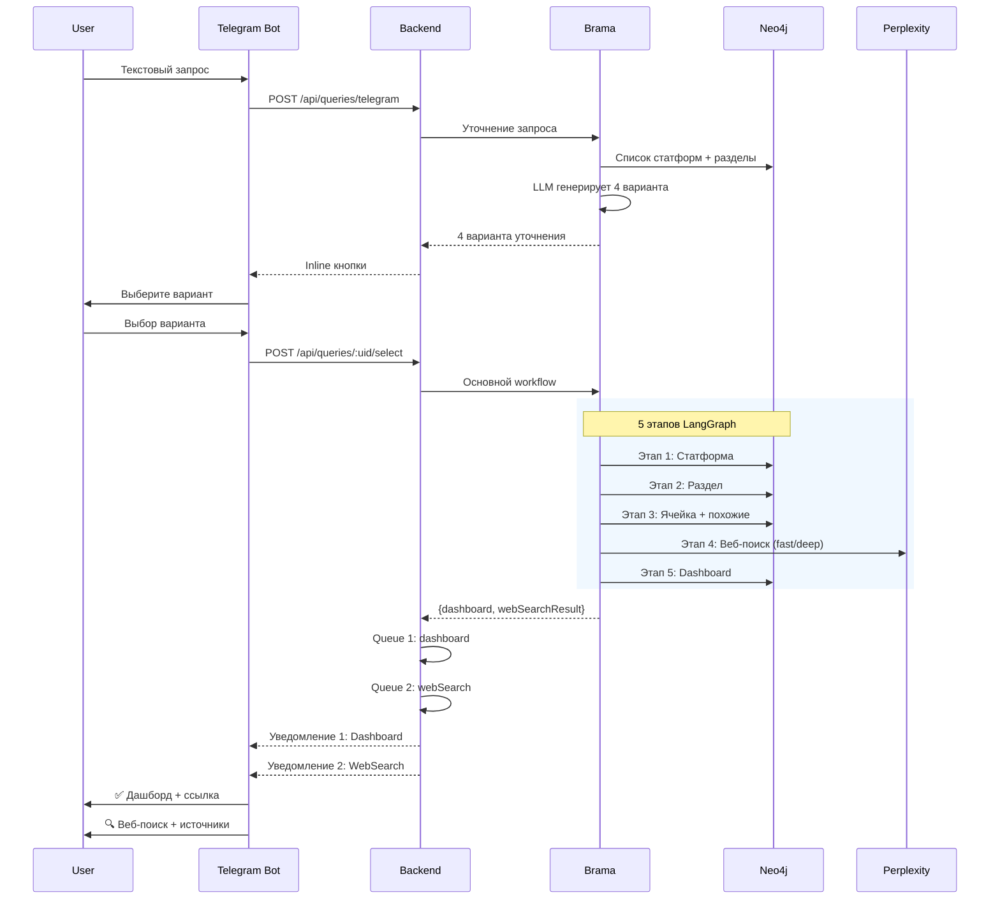
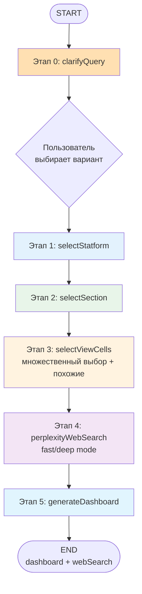
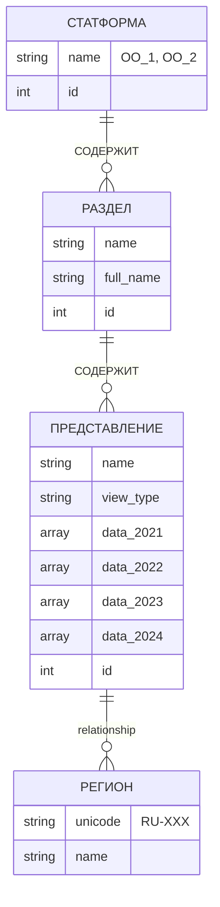

# Архитектура Brama

> **Версия:** 4.0
> **Дата:** 2025-11-26
> **Статус:** ✅ Production

---

## Краткое резюме

**Brama** — сервис обработки запросов на естественном языке для генерации аналитических дашбордов на основе данных из Neo4j.

### Ключевые возможности

- **Уточнение запроса**: LLM генерирует 4 варианта уточнения, пользователь выбирает нужный
- **LangGraph workflow**: 5 последовательных этапов анализа запроса
- **Веб-поиск**: Интеграция Perplexity API для дополнения данных актуальной информацией
- **Множественный выбор**: LLM может анализировать несколько представлений и искать похожие ячейки
- **Graceful degradation**: Система работает даже если веб-поиск недоступен

### Этапы обработки

```
Уточнение запроса (4 варианта) → Пользователь выбирает
  ↓
1. selectStatform    → выбор статформы
2. selectSection     → выбор раздела
3. selectViewCells   → выбор ячейки (+ похожие)
4. perplexityWebSearch → веб-поиск (fast/deep)
5. generateDashboard → формирование графиков
  ↓
Dashboard (2 графика) + WebSearch (отдельное сообщение)
```

---

## Основные компоненты

### 1. DashboardGenerator
**Роль:** Точка входа и оркестратор

```typescript
class DashboardGenerator {
  static async initialize(): Promise<void>
  static async getClarifications(question: string): Promise<ClarificationResult>
  static async generateDashboardWithWebSearch(question: string): Promise<QueryProcessResult>
}
```

### 2. QueryAgent (LangGraph)
**Роль:** Анализ запроса через 5 этапов

```typescript
class QueryAgent {
  async clarifyQuery(query: string): Promise<ClarificationResult>
  async processQueryWithWebSearch(query: string): Promise<QueryProcessResult>
}
```

**Результат:**
```typescript
interface QueryProcessResult {
  dashboard: DashboardData;           // Всегда есть
  webSearchResult?: WebSearchResult;  // Опционально
}
```

### 3. DashboardService
**Роль:** Генерация финального dashboard с графиками

```typescript
async generateDashboard(input: {
  viewId: number;
  colIndex: number;
  rowIndex: number;
  metadata: { viewName, sectionName, statformName };
}): Promise<DashboardData>
```

### 4. Shared Modules

**LLMClient** — DeepSeek через AITunnel
```typescript
chat(systemPrompt: string, userMessage: string): Promise<string>
chatJSON<T>(systemPrompt, userMessage, schema: z.ZodType<T>): Promise<T>
```

**Neo4jClient** — граф образовательной статистики
```typescript
getAvailableYears(viewId: number): Promise<number[]>
getFederalData(viewId: number, years: number[]): Promise<Record<string, any[][]>>
getRegionalData(viewId: number, years: number[]): Promise<RegionalDataRow[]>
```

**PerplexityClient** — веб-поиск
```typescript
fastSearch(query: string): Promise<PerplexityResponse>    // sonar
deepResearch(query: string): Promise<PerplexityResponse>  // sonar-deep-research
```

---

## LangGraph Workflow

### QueryState

```typescript
interface QueryState {
  query: string;

  statformSelection?: {
    statformIds: number[];
    reasoning?: string;
  };

  sectionSelection?: {
    sectionId: number;
    sectionName: string;
    reasoning?: string;
  };

  viewSelection?: {
    cell: { viewId: number; colIndex: number; rowIndex: number; };
    metadata: { viewName: string; sectionName: string; statformName: string; };
    reasoning?: string;
  };

  webSearch?: {
    searchMode: 'fast' | 'deep';
    content: string;
    sources?: string[];
    query: string;
  };

  dashboardData?: DashboardData;
  error?: string;
}
```

### Этап 0: Уточнение запроса (опционально)

**Цель:** Предложить пользователю 4 конкретных варианта на основе данных в Neo4j

**Процесс:**
1. Получить список всех статформ и разделов из Neo4j
2. LLM генерирует 4 варианта уточнения с описаниями
3. Возврат пользователю для выбора
4. После выбора — продолжение основного workflow

**Пример:**
```
Запрос: "школьники"
→ Варианты:
  1. Общее количество школьников по годам
  2. Количество школьников по регионам
  3. Первоклассники в городских школах
  4. Школьники с особыми потребностями
```

### Этап 1: Выбор статформы

**Цель:** Определить релевантную статистическую форму (ОО_1, ОО_2, ...)

**Процесс:**
1. Получить список всех статформ из Neo4j
2. LLM выбирает 1-2 релевантные статформы
3. Сохранить `statformIds[]` в State

### Этап 2: Выбор раздела

**Цель:** Выбрать конкретный раздел внутри статформы

**Процесс:**
1. Получить все разделы для выбранных статформ
2. LLM выбирает наиболее подходящий раздел
3. Сохранить `sectionId` в State

### Этап 3: Выбор ячейки

**Цель:** Найти конкретную ячейку в таблице с нужными данными

**Особенности:**
- **Множественный выбор представлений**: LLM анализирует все доступные таблицы
- **Поиск похожих ячеек**: Находит аналогичные колонки/строки в схеме

**Процесс:**
1. Получить список представлений (views) для раздела
2. Для каждого представления получить схему таблицы
3. LLM выбирает viewId, colIndex, rowIndex
4. Сохранить координаты + metadata в State

### Этап 4: Веб-поиск

**Цель:** Дополнить данные из Neo4j актуальной информацией из интернета

**Процесс:**
1. LLM анализирует результаты этапа 3
2. LLM оценивает качество данных и формирует поисковый запрос
3. LLM выбирает режим:
   - `'fast'` (sonar) — если данные хорошие, нужно только дополнение
   - `'deep'` (sonar-deep-research) — если данные неполные
4. Выполнение запроса к Perplexity API
5. Сохранить `webSearch` в State (или `undefined` при ошибке)

**Graceful degradation:**
- Если Perplexity API недоступен → `webSearch = undefined`
- Workflow продолжается без веб-поиска

### Этап 5: Генерация dashboard

**Цель:** Создать финальный dashboard с двумя графиками

**Процесс:**
1. DashboardService извлекает данные из Neo4j
2. Формирует линейный график (федеральные данные)
3. Формирует карту России (региональные данные)
4. Сохранить `dashboardData` в State

---

## Диаграммы

### Sequence Diagram



### State Flow



### Структура модулей

```
brama/src/
├── utils/
│   └── dashboardGenerator.ts       # Точка входа
├── query-agent/                    # LangGraph workflow
│   ├── index.ts                    # QueryAgent
│   ├── graph/
│   │   ├── graph.ts                # Определение графа
│   │   ├── state.ts                # QueryState
│   │   └── nodes/
│   │       ├── selectStatformNode.ts
│   │       ├── selectSectionNode.ts
│   │       ├── selectViewCellsNode.ts
│   │       ├── perplexityWebSearchNode.ts
│   │       └── generateDashboardNode.ts
│   ├── prompts/                    # LLM промпты
│   │   ├── queryClarification.ts
│   │   ├── statformSelection.ts
│   │   ├── sectionSelection.ts
│   │   ├── viewCellSelection.ts
│   │   └── webSearchDecision.ts
│   └── modules/                    # Вспомогательные функции
├── dashboard-service/              # Генерация графиков
│   ├── dashboardGenerator.ts
│   ├── cellExtractor.ts
│   └── chartFormatters/
│       ├── linearChart.ts
│       └── russiaMapChart.ts
└── shared/                         # Общие клиенты
    ├── llmClient.ts                # DeepSeek
    ├── neo4jClient.ts              # Neo4j
    ├── perplexityClient.ts         # Perplexity API
    └── logger.ts
```

---

## Контракты API

### DashboardGenerator.getClarifications()

```typescript
getClarifications(question: string): Promise<ClarificationResult>

interface ClarificationResult {
  suggestions: Array<{
    id: number;
    label: string;           // "Общее количество"
    description: string;     // "Общее количество школьников..."
  }>;
  reasoning?: string;
}
```

### DashboardGenerator.generateDashboardWithWebSearch()

```typescript
generateDashboardWithWebSearch(question: string): Promise<QueryProcessResult>

interface QueryProcessResult {
  dashboard: DashboardData;
  webSearchResult?: WebSearchResult;
}

interface WebSearchResult {
  searchMode: 'fast' | 'deep';
  content: string;
  sources?: string[];
  query: string;
}
```

### DashboardData

```typescript
interface DashboardData {
  dashboard: {
    title: string;
    description: string;
    charts: [LinearChart, RussiaMapChart];  // Ровно 2 графика
  };
}
```

**LinearChart:**
```typescript
{
  type: 'linear',
  title: 'Федеральные данные по годам',
  data: {
    years: [{
      points: [
        { x: 2021, y: 17314160 },
        { x: 2022, y: 17745037 },
        { x: 2023, y: null },      // null если нет данных
        { x: 2024, y: 17988139 }
      ]
    }]
  }
}
```

**RussiaMapChart:**
```typescript
{
  type: 'russia_map',
  title: 'Интерактивная карта России',
  data: {
    years: [
      {
        year: 2021,
        regions: [
          { regionCode: 'RU-MOW', value: 5432 },
          { regionCode: 'RU-SPE', value: 3210 },
          { regionCode: 'RU-SVE', value: null }
        ]
      }
    ]
  }
}
```

### Callback формат

**С веб-поиском:**
```json
{
  "status": "completed",
  "result": {
    "dashboard": { "title": "...", "charts": [...] },
    "webSearchResult": {
      "searchMode": "fast",
      "content": "По данным Минпросвещения...",
      "sources": ["https://edu.gov.ru/..."],
      "query": "общая численность школьников 2025"
    }
  }
}
```

**Без веб-поиска:**
```json
{
  "status": "completed",
  "result": {
    "dashboard": { "title": "...", "charts": [...] }
  }
}
```

---

## Neo4j Schema

### ER Диаграмма



**⚠️ Важно:** Региональные данные хранятся в **СВЯЗИ** между ПРЕДСТАВЛЕНИЕ и РЕГИОН:

```cypher
MATCH (view)-[r]->(region)
WHERE id(view) = 456
RETURN
  region.unicode AS regionCode,
  r.data_2021 AS data_2021,  ← данные в связи!
  r.data_2022 AS data_2022
```

---

## Переменные окружения

### Обязательные

```bash
# LLM
OPENAI_API_KEY=sk-aitunnel-xxx      # AITunnel (DeepSeek)
DEEPSEEK_MODEL=deepseek-chat

# Perplexity
PERPLEXITY_API_KEY=pplx-xxx         # Веб-поиск

# Neo4j
NEO4J_URI=bolt://neo4j:7687
NEO4J_USERNAME=neo4j
NEO4J_PASSWORD=xxx

# Redis
REDIS_HOST=redis
REDIS_PORT=6379

# Backend
BACKEND_URL=http://backend:5000
```

### Опциональные

```bash
# Worker
WORKER_CONCURRENCY=2
DEFAULT_YEAR=2024

# LangSmith (трассировка)
LANGSMITH_API_KEY=lsv2_pt_xxx
LANGSMITH_TRACING=true
LANGSMITH_PROJECT=ed-analytics
```

### Получение API ключей

**AITunnel (DeepSeek):**
1. https://aitunnel.ru → API Keys
2. Стоимость: ~$0.001-0.002 за запрос

**Perplexity:**
1. https://www.perplexity.ai → Settings → API
2. Стоимость:
   - `sonar` (fast): ~$1 / 1000 запросов
   - `sonar-deep-research` (deep): ~$5 / 1000 запросов

**LangSmith (опционально):**
1. https://smith.langchain.com → Settings → API Keys
2. Трассировка всех 5 этапов + веб-поиска

---

## Примеры

### Пример 1: Полный цикл

**Запрос:** "сколько школьников?"

**Этап 0 (уточнение):**
```
→ 4 варианта:
  1. Общее количество школьников по годам
  2. Количество школьников по регионам  ← пользователь выбирает
  3. Первоклассники
  4. Школьники с ОВЗ
```

**Этапы 1-3 (выбор данных):**
```
→ statformIds: [852] (ОО_1)
→ sectionId: 123 (Сведения об обучающихся)
→ viewId: 456, colIndex: 2, rowIndex: 0
```

**Этап 4 (веб-поиск):**
```
→ LLM анализирует: данные есть до 2024, нужно дополнение
→ searchMode: 'fast'
→ query: "общая численность школьников в России 2025 год"
→ content: "По данным Минпросвещения на начало 2024/2025..."
```

**Этап 5 (dashboard):**
```json
{
  "dashboard": {
    "title": "Количество обучающихся",
    "charts": [
      { "type": "linear", "data": {...} },
      { "type": "russia_map", "data": {...} }
    ]
  }
}
```

**Результат в Telegram:**
- Сообщение 1: Dashboard + описание + данные + ссылка
- Сообщение 2: Веб-поиск (fast mode) + контент + источники

---

## Checklist

### Неизменяемые контракты
- [x] `generateDashboardWithWebSearch(question: string)` принимает строку
- [x] Возвращает `{dashboard, webSearchResult?}`
- [x] `dashboard.charts` — массив из ровно 2 элементов
- [x] Первый график: `type: 'linear'`
- [x] Второй график: `type: 'russia_map'`
- [x] Коды регионов: `'RU-XXX'` (ISO 3166-2:RU)

### Реализация
- [x] QueryAgent на LangGraph
- [x] 5 этапов workflow
- [x] Уточнение запроса (4 варианта)
- [x] Множественный выбор представлений
- [x] Поиск похожих ячеек
- [x] Perplexity Web Search (fast/deep)
- [x] Graceful degradation
- [x] Отдельная очередь telegram-web-search
- [x] Shared modules (LLM, Neo4j, Perplexity, Logger)
- [x] LangSmith трассировка
- [x] Concurrency=2
- [x] Ошибки на русском
- [x] Timeout 60s
- [x] Идемпотентность
