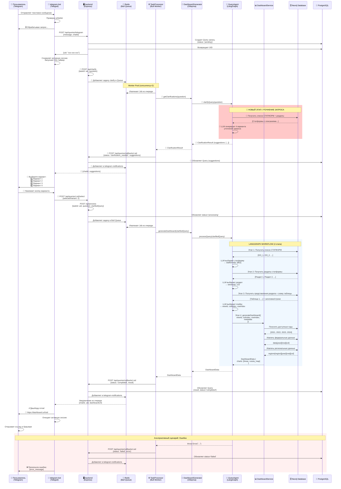
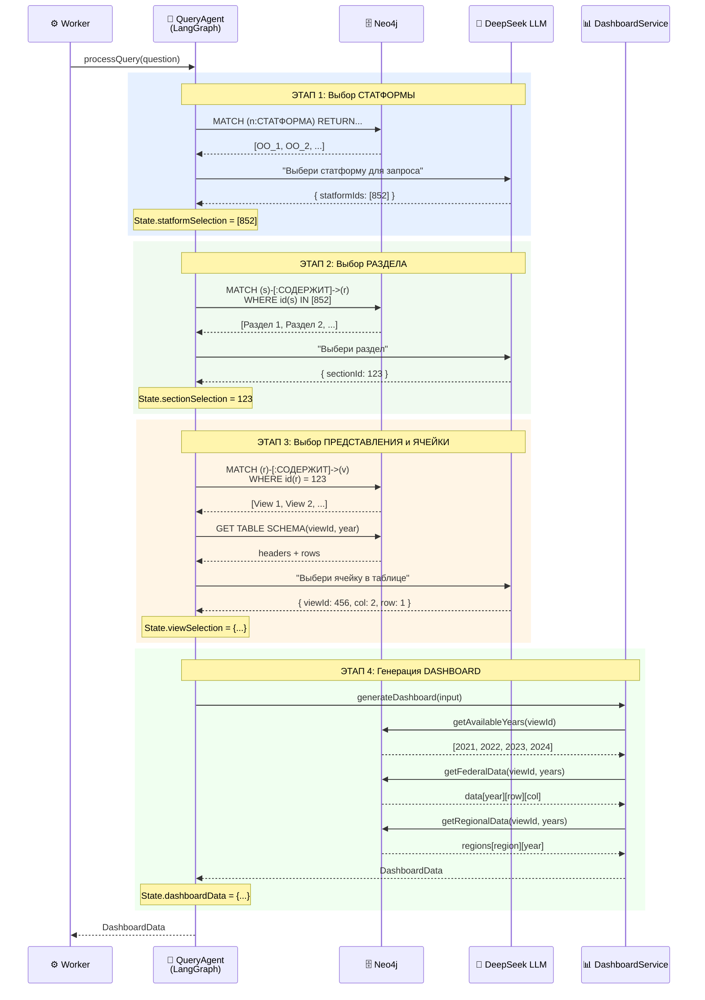
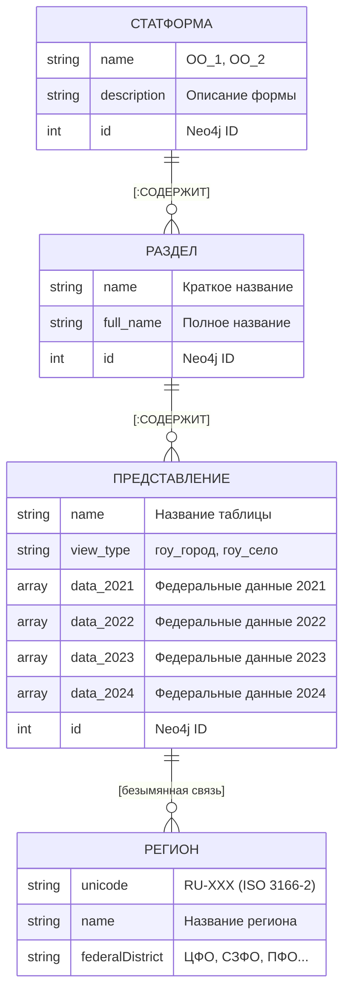
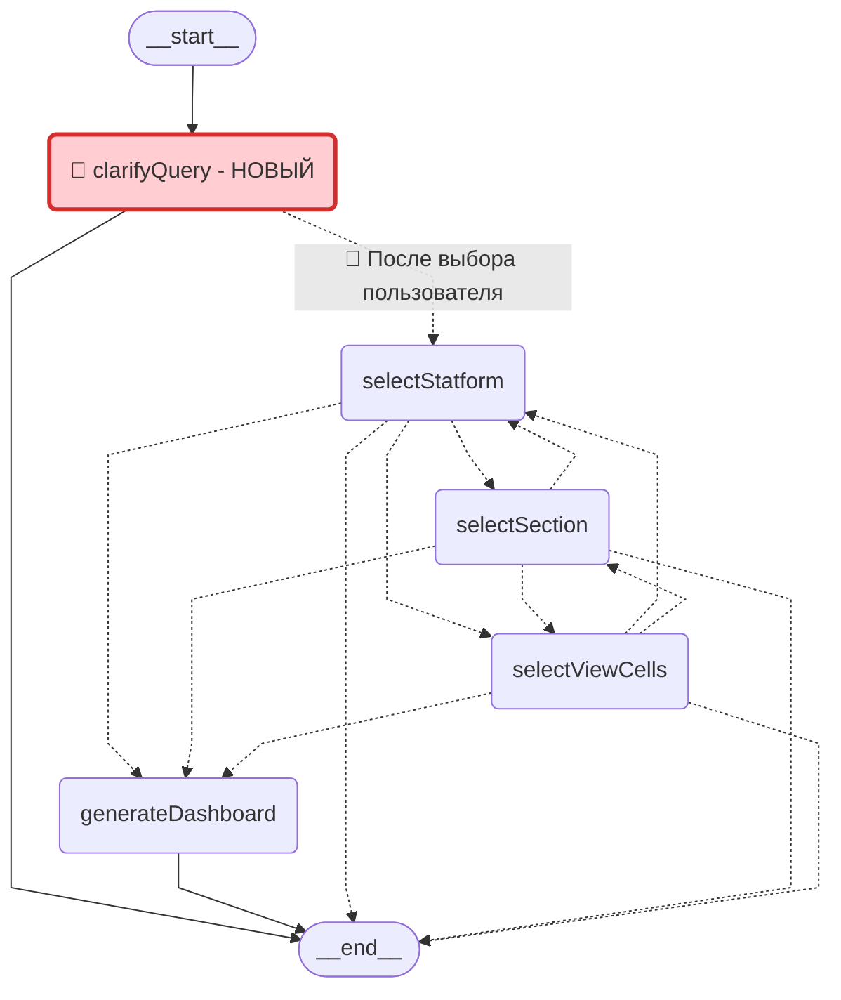

# Документация архитектуры Brama

> **Версия документа:** 3.0
> **Последнее обновление:** 2025-11-20
> **Статус:** ✅ Реализовано на LangGraph
> **Цель:** Описать текущую архитектуру обработки запросов в сервисе Brama

---

## 📌 Краткое резюме

Этот документ описывает **текущую реализацию** сервиса **brama** на основе **LangGraph**.

### Текущая архитектура (v3.0)

Система построена на **LangGraph workflow** с 4 последовательными этапами обработки запроса:

1. **QueryAgent** - анализирует запрос через LangGraph (4 этапа)
2. **DashboardService** - генерирует финальный dashboard с графиками
3. **Shared modules** - переиспользуемые клиенты (LLM, Neo4j, Logger)

---

### 🔴 ПЛАНИРУЕМОЕ ИЗМЕНЕНИЕ: Этап уточнения запроса

> **⚠️ TODO:** Добавить новый этап **ДО** текущего workflow, который будет предлагать пользователю 4 варианта уточнения запроса на основе данных в базе.

**Новый поток:**
```
User Query → 🔴 clarifyQueryNode (НОВЫЙ) → [4 варианта уточнения] → User выбирает → Текущий workflow (4 этапа)
```

### 🔒 Неизменяемые контракты

❌ **Сигнатура `DashboardGenerator.generateDashboard(question: string)`** - принимает текстовый запрос
❌ **Формат возвращаемого значения `DashboardData`** - структура с 2 графиками (linear + russia_map)

### Главное правило

**ВХОД:** Текстовый запрос от пользователя (string)
**ВЫХОД:** Готовый dashboard JSON (DashboardData)

### 📚 История изменений

<details>
<summary><b>v2.0 → v3.0: Миграция на LangGraph</b></summary>

#### Что изменилось:

**Старая архитектура (v2.0):**
- LLMService - один вызов LLM для анализа запроса
- Neo4jService - извлечение данных из Neo4j
- Параметры: `{ form_code, view_type, section, col_index, row_index }`

**Новая архитектура (v3.0):**
- QueryAgent (LangGraph) - 4 последовательных этапа с промежуточными вызовами LLM
- DashboardService - переименованный и улучшенный Neo4jService
- Shared modules - выделены общие клиенты
- Новые параметры: `{ statformIds[], sectionId, viewId, colIndex, rowIndex, metadata }`

#### Почему изменили:

✅ **Точность:** Пошаговый выбор статформы → раздела → представления → ячейки
✅ **Прозрачность:** Каждый этап с reasoning от LLM
✅ **Масштабируемость:** LangGraph позволяет легко добавлять новые этапы
✅ **Трассировка:** Интеграция с LangSmith из коробки
✅ **Переиспользование:** Общие клиенты в shared модуле

</details>

---

## Оглавление

### 📖 Уровень 1: Высокоуровневая архитектура
- [Обзор системы](#обзор-системы)
- [Общая схема обработки запроса](#общая-схема-обработки-запроса)
- [Основные компоненты](#основные-компоненты)

### 🔧 Уровень 2: Детальная архитектура
- [LangGraph Workflow (4 этапа)](#langgraph-workflow-4-этапа)
- [Диаграммы и схемы](#диаграммы-и-схемы)
  - [Диаграмма 1: Sequence Diagram - Полный пайплайн](#диаграмма-1-sequence-diagram---полный-пайплайн)
  - [Диаграмма 2: Структура модулей](#диаграмма-2-структура-модулей)
  - [Диаграмма 3: State Flow - Изменение состояния](#диаграмма-3-state-flow---изменение-состояния)
  - [Диаграмма 4: ER диаграмма Neo4j](#диаграмма-4-er-диаграмма-neo4j)
  - [Диаграмма 5: LangGraph Architecture (Auto-generated)](#диаграмма-5-langgraph-architecture-auto-generated)
- [QueryAgent (замена LLMService)](#queryagent-замена-llmservice)
- [DashboardService (замена Neo4jService)](#dashboardservice-замена-neo4jservice)
- [Shared Modules](#shared-modules)

### 📋 Справочная информация
- [Интеграционные контракты](#интеграционные-контракты)
- [Формат данных DashboardData](#формат-данных-dashboarddata)
- [Переменные окружения](#переменные-окружения)
- [Примеры запросов и результатов](#примеры-запросов-и-результатов)

---

## Обзор системы

Система `ed_analytics` состоит из трех микросервисов:

1. **telegram-bot** - принимает запросы пользователей из Telegram
2. **backend** - управляет запросами, БД и уведомлениями
3. **brama** - обрабатывает запросы и генерирует dashboard

### Архитектура модуля brama

Модуль **brama** содержит следующие ключевые компоненты:

1. **DashboardGenerator** (`brama/src/utils/dashboardGenerator.ts`)
   - **Роль**: Главный оркестратор процесса генерации dashboard
   - **Задачи**:
     - Инициализирует LLMService и Neo4jService при старте сервера
     - Принимает текстовый запрос пользователя
     - Вызывает LLMService для анализа запроса
     - Вызывает Neo4jService для извлечения данных
     - Возвращает готовый JSON dashboard
   - **Важно**: DashboardGenerator - это единственная точка входа для обработки запросов

2. **LLMService** (`brama/src/services/llmService.ts`)
   - **Роль**: Анализ запроса на естественном языке
   - **Вход**: Текстовый запрос пользователя
   - **Выход**: Структурированные параметры (form_code, view_type, section, col_index, row_index)

3. **Neo4jService** (`brama/src/services/neo4jService.ts`)
   - **Роль**: Извлечение данных из Neo4j
   - **Вход**: Параметры от LLMService
   - **Выход**: JSON dashboard с графиками

---

## Общая схема обработки запроса

> **💡 Как читать эту диаграмму:**
> - Участники показаны сверху (User, Bot, Backend, Worker, ...)
> - Стрелки показывают направление вызовов (→ синхронный, --→ ответ)
> - Синий блок = основная логика Brama (LangGraph workflow)
> - Красный блок = обработка ошибок



> **🔴 ИЗМЕНЕНИЯ В СХЕМЕ:**
> - Новый endpoint `POST /api/clarify` для запроса уточнений
> - Новый метод `getClarifications()` в DashboardGenerator
> - Новый этап `clarifyQuery` в LangGraph (красный блок)
> - Новый статус `clarification_needed` в callback
> - Inline кнопки в Telegram для выбора варианта
> - Новый endpoint `POST /api/queries/:uid/select` для выбора варианта

---

## Основные компоненты

### 1. DashboardGenerator (`brama/src/utils/dashboardGenerator.ts`)

**Роль:** Тонкая обертка и точка входа для обработки запросов

**Методы:**
```typescript
class DashboardGenerator {
  static async initialize(): Promise<void>
  static async generateDashboard(question: string): Promise<DashboardData>
  static async shutdown(): Promise<void>
}
```

**Реализация:**
- При `initialize()` создает экземпляр QueryAgent
- При `generateDashboard(question)` делегирует обработку в QueryAgent
- Возвращает готовый DashboardData

---

### 2. QueryAgent (`brama/src/query-agent/`)

**Роль:** Анализ запроса через LangGraph workflow (замена LLMService)

**Основной метод:**
```typescript
async processQuery(query: string): Promise<DashboardData>
```

**Архитектура:**
- Построен на **LangGraph** (@langchain/langgraph)
- 4 последовательных узла (nodes)
- Каждый узел обновляет общее состояние (State)
- Поддержка LangSmith трассировки

**Этапы обработки:**
1. `selectStatformNode` - выбор статформы
2. `selectSectionNode` - выбор раздела
3. `selectViewCellsNode` - выбор представления и ячейки
4. `generateDashboardNode` - генерация dashboard

---

### 3. DashboardService (`brama/src/dashboard-service/`)

**Роль:** Генерация финального dashboard с графиками (замена Neo4jService)

**Основной метод:**
```typescript
async generateDashboard(input: DashboardServiceInput): Promise<DashboardData>
```

**Входные данные:**
```typescript
interface DashboardServiceInput {
  query: string;           // Оригинальный запрос
  viewId: number;          // ID представления
  colIndex: number;        // Индекс колонки
  rowIndex: number;        // Индекс строки
  metadata: {
    viewName: string;
    sectionName: string;
    statformName: string;
  };
}
```

**Процесс:**
1. Получает доступные годы из Neo4j
2. Извлекает федеральные данные (для линейного графика)
3. Извлекает региональные данные (для карты России)
4. Форматирует два графика
5. Возвращает DashboardData

---

### 4. Shared Modules (`brama/src/shared/`)

**LLMClient** - клиент для работы с LLM (DeepSeek через AITunnel)
```typescript
chat(systemPrompt: string, userMessage: string, temperature?: number): Promise<string>
chatJSON<T>(systemPrompt: string, userMessage: string, schema: z.ZodType<T>, temperature?: number): Promise<T>
```

**Neo4jClient** - клиент для работы с Neo4j (Singleton)
```typescript
executeQuery<T>(query: string, params?: Record<string, any>): Promise<T[]>
getAvailableYears(viewId: number): Promise<number[]>
getFederalData(viewId: number, years: number[]): Promise<Record<string, any[][]>>
getRegionalData(viewId: number, years: number[]): Promise<RegionalDataRow[]>
```

**Logger** - система логирования с уровнями
```typescript
debug(message: string, ...args: any[]): void
info(message: string, ...args: any[]): void
warn(message: string, ...args: any[]): void
error(message: string, error?: Error): void
```


---

## LangGraph Workflow (4 этапа)

> **💡 Что такое LangGraph:**
> LangGraph - это фреймворк для построения stateful workflows с использованием LLM. Workflow представляет собой граф узлов (nodes), где каждый узел выполняет определенную задачу и обновляет общее состояние (State).

### 🔴 ТРЕБУЕТСЯ ИЗМЕНЕНИЕ: Архитектура workflow

```typescript
interface QueryState {
  query: string;                      // Входной запрос

  // 🔴 НОВОЕ ПОЛЕ: Результат этапа уточнения
  clarification?: {
    suggestions: Array<{
      id: number;
      clarifiedQuery: string;      // Уточненный запрос
      description: string;          // Описание для пользователя
      relevantStatforms: string[];  // Какие статформы используются
    }>;
    reasoning?: string;
  };

  statformSelection?: {               // Результат этапа 1
    statformIds: number[];
    reasoning?: string;
  };
  sectionSelection?: {                // Результат этапа 2
    sectionId: number;
    sectionName: string;
    reasoning?: string;
  };
  viewSelection?: {                   // Результат этапа 3
    cell: {
      viewId: number;
      colIndex: number;
      rowIndex: number;
    };
    metadata: {
      viewName: string;
      sectionName: string;
      statformName: string;
    };
    reasoning?: string;
  };
  dashboardData?: DashboardData;      // Результат этапа 4
  error?: string;
}
```

> **🔴 Файл для изменения:** `brama/src/query-agent/graph/state.ts`

---

### 🔴 НОВЫЙ ЭТАП 0: Уточнение запроса (clarifyQueryNode)

> **⚠️ СОЗДАТЬ НОВЫЙ ФАЙЛ:** `brama/src/query-agent/graph/nodes/clarifyQueryNode.ts`

**Цель:** Предложить пользователю 4 варианта уточнения запроса на основе данных в базе

**Процесс:**
1. Получить список всех СТАТФОРМ и их разделов из Neo4j
2. Создать промпт с описанием доступных данных
3. LLM генерирует 4 варианта уточнения запроса
4. Возвращает варианты пользователю для выбора (НЕ продолжает workflow!)

**Пример:**
```
Запрос: "школьники"
→ LLM возвращает 4 варианта:
  1. "Общее количество школьников по годам" (ОО_1, Раздел 1)
  2. "Количество школьников по регионам" (ОО_1, Раздел 1)
  3. "Количество первоклассников" (ОО_1, Раздел 2)
  4. "Школьники с особыми потребностями" (ОО_1, Раздел 5)
```

**🔴 Файлы для создания/изменения:**
- `brama/src/query-agent/graph/nodes/clarifyQueryNode.ts` — СОЗДАТЬ
- `brama/src/query-agent/prompts/queryClarification.ts` — СОЗДАТЬ
- `brama/src/query-agent/graph/graph.ts` — ИЗМЕНИТЬ (добавить узел)

---

### Этап 1: Выбор статформы (selectStatformNode)

**Цель:** Определить релевантную статистическую форму для запроса

**Процесс:**
1. Получить список всех СТАТФОРМ из Neo4j
2. Создать промпт с описанием каждой статформы
3. LLM анализирует запрос и выбирает 1-2 релевантные статформы
4. Сохранить `statformIds[]` в State

**Пример:**
```
Запрос: "Сколько школьников в Москве?"
→ LLM выбирает: statformIds: [852] (ОО_1)
→ Reasoning: "Запрос касается школьников, что относится к статформе ОО_1"
```

---

### Этап 2: Выбор раздела (selectSectionNode)

**Цель:** Выбрать конкретный раздел внутри статформы

**Процесс:**
1. Получить все разделы для выбранных статформ
2. Создать промпт с названиями разделов
3. LLM выбирает наиболее подходящий раздел
4. Сохранить `sectionId` и `sectionName` в State

**Пример:**
```
Запрос: "Сколько школьников в Москве?"
→ LLM выбирает: sectionId: 123, sectionName: "Раздел 1. Сведения об обучающихся"
→ Reasoning: "Раздел содержит данные о количестве обучающихся"
```

---

### Этап 3: Выбор представления и ячейки (selectViewCellsNode)

**Цель:** Найти конкретную ячейку в таблице с нужными данными

**Процесс:**
1. Получить список представлений (view) для раздела
2. Получить схему таблицы (заголовки колонок и строк)
3. Создать промпт со структурой таблицы
4. LLM выбирает представление и координаты ячейки
5. Сохранить `viewId`, `colIndex`, `rowIndex`, `metadata` в State

**Пример:**
```
Запрос: "Сколько школьников в Москве?"
→ Схема таблицы:
  Колонки: ["№", "Наименование", "Всего", "1 класс", "2 класс", ...]
  Строки: ["Москва", "Санкт-Петербург", ...]
→ LLM выбирает: viewId: 456, colIndex: 2 ("Всего"), rowIndex: 1 ("Москва")
→ Metadata: { viewName: "Таблица 1", sectionName: "Раздел 1", statformName: "ОО_1" }
```

---

### Этап 4: Генерация dashboard (generateDashboardNode)

**Цель:** Создать финальный dashboard с двумя графиками

**Процесс:**
1. Вызвать DashboardService с параметрами из State
2. DashboardService извлекает данные из Neo4j
3. Форматирует линейный график (федеральные данные)
4. Форматирует карту России (региональные данные)
5. Сохранить `dashboardData` в State

**Пример:**
```
Input: { viewId: 456, colIndex: 2, rowIndex: 1, metadata: {...} }
→ Извлечение данных из ячейки [1][2] за все годы
→ Федеральные данные: { 2021: 1234, 2022: 1256, 2023: 1278, 2024: 1301 }
→ Региональные данные: { "RU-MOW": {...}, "RU-SPE": {...}, ... }
→ Output: DashboardData с 2 графиками
```

---

## Диаграммы и схемы

### Диаграмма 1: Sequence Diagram - Полный пайплайн

> **💡 Как читать эту диаграмму:**
> - **Горизонтальная ось:** Участники процесса (Worker, QueryAgent, Neo4j)
> - **Вертикальная ось:** Время (сверху вниз)
> - **Стрелки →:** Синхронные вызовы
> - **Пунктирные стрелки --→:** Ответы
> - **Прямоугольники:** Группировка логических блоков
> - **Note:** Комментарии к процессу



---

### Диаграмма 2: Структура модулей

> **💡 Как читать эту диаграмму:**
> - **Директории** показаны с `/` в конце
> - **Файлы** без `/`
> - **Отступы** показывают вложенность
> - `├──` и `└──` показывают иерархию

```
brama/
├── src/
│   ├── utils/
│   │   └── dashboardGenerator.ts       # 🎯 Точка входа (обертка) 🔴 ИЗМЕНИТЬ
│   │
│   ├── query-agent/                    # 🤖 Анализ запроса (LangGraph)
│   │   ├── index.ts                    # QueryAgent класс 🔴 ИЗМЕНИТЬ
│   │   ├── types.ts                    # TypeScript интерфейсы 🔴 ИЗМЕНИТЬ
│   │   ├── graph/
│   │   │   ├── graph.ts                # LangGraph workflow definition 🔴 ИЗМЕНИТЬ
│   │   │   ├── state.ts                # QueryState интерфейс 🔴 ИЗМЕНИТЬ
│   │   │   └── nodes/                  # Узлы графа
│   │   │       ├── clarifyQueryNode.ts         # 🔴 СОЗДАТЬ - Этап 0 (уточнение)
│   │   │       ├── selectStatformNode.ts       # Этап 1
│   │   │       ├── selectSectionNode.ts        # Этап 2
│   │   │       ├── selectViewCellsNode.ts      # Этап 3
│   │   │       └── generateDashboardNode.ts    # Этап 4
│   │   ├── prompts/                    # LLM промпты
│   │   │   ├── queryClarification.ts   # 🔴 СОЗДАТЬ - Промпт для уточнения
│   │   │   ├── statformSelection.ts
│   │   │   ├── sectionSelection.ts
│   │   │   └── viewCellSelection.ts
│   │   └── modules/                    # Вспомогательные модули
│   │       ├── statformList.ts         # Получение статформ
│   │       ├── sectionList.ts          # Получение разделов
│   │       ├── viewList.ts             # Получение представлений
│   │       └── schemaBuilder.ts        # Построение схемы таблицы
│   │
│   ├── dashboard-service/              # 📊 Генерация dashboard
│   │   ├── index.ts                    # Экспорт API
│   │   ├── dashboardGenerator.ts       # Главный класс
│   │   ├── cellExtractor.ts            # Извлечение значений ячеек
│   │   ├── types.ts                    # TypeScript интерфейсы
│   │   └── chartFormatters/
│   │       ├── linearChart.ts          # Линейный график
│   │       └── russiaMapChart.ts       # Карта России
│   │
│   ├── shared/                         # 🔧 Общие модули
│   │   ├── llmClient.ts                # LLM клиент (DeepSeek)
│   │   ├── neo4jClient.ts              # Neo4j клиент (Singleton)
│   │   └── logger.ts                   # Система логирования
│   │
│   ├── services/
│   │   └── queueService.ts             # Bull Queue
│   ├── workers/
│   │   └── taskProcessor.ts            # Worker обработки
│   └── server.ts                       # Express сервер
│
├── data/
│   ├── regions.json                    # Данные регионов
│   ├── Список_таблиц_ОО_1.csv
│   └── Список_таблиц_ОО_2.csv
│
└── logs/llm/                           # Логи LLM запросов
```

**Ключевые компоненты:**
- `query-agent/` - **Анализ запроса** (4 этапа LangGraph)
- `dashboard-service/` - **Генерация dashboard** (извлечение и форматирование данных)
- `shared/` - **Переиспользуемые клиенты** (LLM, Neo4j, Logger)

---

### Диаграмма 3: State Flow - Изменение состояния

> **💡 Как читать эту диаграмму:**
> - **Овалы:** Узлы графа (этапы обработки)
> - **Прямоугольники:** Состояние (State) после каждого этапа
> - **Стрелки →:** Передача управления
> - **Синий цвет:** LLM узлы (вызывают DeepSeek)
> - **Зеленый цвет:** Data узлы (работают с Neo4j)

```mermaid
graph TD
    Start([🚀 START]) --> S0{{"🔴 НОВЫЙ Этап 0<br/>clarifyQuery"}}

    S0 --> State0["📦 State<br/>query: string<br/>🔴 clarification: {<br/>  suggestions: [4 варианта]<br/>}"]

    State0 --> UserChoice([🔴 Возврат пользователю<br/>для выбора варианта])

    UserChoice --> S1{{"🔹 Этап 1<br/>selectStatform"}}

    S1 --> State1["📦 State<br/>query: string (уточненный)<br/>statformSelection: {<br/>  statformIds: [852]<br/>}"]

    State1 --> S2{{"🔹 Этап 2<br/>selectSection"}}

    S2 --> State2["📦 State<br/>query: string<br/>statformSelection: {...}<br/>sectionSelection: {<br/>  sectionId: 123,<br/>  sectionName: 'Раздел 1'<br/>}"]

    State2 --> S3{{"🔹 Этап 3<br/>selectViewCells"}}

    S3 --> State3["📦 State<br/>query: string<br/>statformSelection: {...}<br/>sectionSelection: {...}<br/>viewSelection: {<br/>  cell: {viewId, col, row},<br/>  metadata: {...}<br/>}"]

    State3 --> S4{{"🔸 Этап 4<br/>generateDashboard"}}

    S4 --> State4["📦 State<br/>query: string<br/>statformSelection: {...}<br/>sectionSelection: {...}<br/>viewSelection: {...}<br/>dashboardData: {<br/>  dashboard: {<br/>    charts: [linear, map]<br/>  }<br/>}"]

    State4 --> End([✅ END])

    style S0 fill:#FFCDD2
    style State0 fill:#FFCDD2
    style UserChoice fill:#FFCDD2
    style S1 fill:#E3F2FD
    style S2 fill:#E3F2FD
    style S3 fill:#E3F2FD
    style S4 fill:#E8F5E9
    style State1 fill:#FFF9C4
    style State2 fill:#FFF9C4
    style State3 fill:#FFF9C4
    style State4 fill:#C8E6C9
```



> **🔴 ВАЖНО:** После `clarifyQuery` workflow **ПРЕРЫВАЕТСЯ** и возвращает варианты пользователю. Только после выбора пользователем одного из вариантов запускается основной workflow (Этапы 1-4).

---

### Диаграмма 4: ER Диаграмма Neo4j

> **💡 Как читать эту диаграмму:**
> - **Прямоугольники:** Узлы (nodes) в Neo4j
> - **Линии с текстом:** Связи (relationships)
> - **||--o{:** Один ко многим (один СТАТФОРМА содержит много РАЗДЕЛов)
> - **Атрибуты:** Свойства узлов или связей
> - **⚠️ ВАЖНО:** Региональные данные хранятся в СВЯЗИ, а не в узле РЕГИОН!



**⚠️ КРИТИЧЕСКАЯ ОСОБЕННОСТЬ СХЕМЫ:**

Региональные данные хранятся **НЕ в узле РЕГИОН**, а в **СВЯЗИ между ПРЕДСТАВЛЕНИЕ и РЕГИОН**!

```
(ПРЕДСТАВЛЕНИЕ)-[r {
  data_2021: [...],
  data_2022: [...],
  data_2023: [...],
  data_2024: [...]
}]->(РЕГИОН)
```

**Пример Cypher запроса:**
```cypher
MATCH (view)-[r]->(region)
WHERE id(view) = 456
RETURN
  region.unicode AS regionCode,
  r.data_2021 AS data_2021,    ← данные в СВЯЗИ!
  r.data_2022 AS data_2022
```

**Формат данных в data_YYYY:**
```typescript
// Массив объектов (строки таблицы)
[
  { col_0: 1, col_1: "Название строки", col_2: 123.4, col_3: 567.8, ... },
  { col_0: 2, col_1: "Другая строка", col_2: 234.5, col_3: 678.9, ... },
  ...
]

// Преобразуется в двумерный массив
[
  [1, "Название строки", 123.4, 567.8, ...],
  [2, "Другая строка", 234.5, 678.9, ...],
  ...
]

// Доступ к ячейке: data[rowIndex][colIndex]
// Пример: data[1][2] = 123.4
```

---

### Диаграмма 5: LangGraph Architecture (Auto-generated)

> **💡 Как читать эту диаграмму:**
> - **Прямоугольники:** Узлы графа (этапы обработки)
> - **Овалы:** Точки входа (__start__) и выхода (__end__)
> - **Сплошные стрелки →:** Обязательные переходы
> - **Пунктирные стрелки -.->:** Условные переходы
> - **Цвета узлов:** Соответствуют этапам (Голубой → Зеленый → Оранжевый → Фиолетовый)
> - **⚠️ Важно:** Эта диаграмма автоматически сгенерирована из реального кода LangGraph!



> **🔴 ИЗМЕНЕНИЕ:** Добавлен новый узел `clarifyQuery` в начало графа. После выполнения он возвращает результат пользователю и **ПРЕРЫВАЕТ** workflow. Продолжение (selectStatform и далее) происходит только после выбора пользователем одного из вариантов.

**Что показывает эта диаграмма:**

1. **Точка входа:** `__start__` → автоматический переход на `selectStatform`
2. **Условные переходы:** Каждый узел может:
   - Перейти к следующему этапу (при успехе)
   - Перейти к `__end__` (при ошибке)
   - В некоторых случаях вернуться к предыдущим этапам
3. **Финальный этап:** `generateDashboard` → всегда переходит к `__end__`

**Интерпретация пунктирных стрелок:**

LangGraph использует **условные переходы** (conditional edges), которые проверяют состояние после выполнения узла:
- Если `state.error` установлен → переход к `__end__`
- Иначе → переход к следующему узлу

---

## Интеграционные контракты

### 🔒 Неизменяемый контракт: DashboardGenerator

**Точка входа системы** - единственный публичный API:

```typescript
class DashboardGenerator {
  // Инициализация при старте сервера
  static async initialize(): Promise<void>

  // Главный метод обработки запроса
  static async generateDashboard(question: string): Promise<DashboardData>

  // Graceful shutdown
  static async shutdown(): Promise<void>
}
```

**Требования:**
- ✅ Метод `generateDashboard` принимает **только** строку (текстовый запрос)
- ✅ Метод `generateDashboard` возвращает **только** DashboardData
- ✅ Поддержка **параллельных вызовов** (concurrency=2)
- ✅ Все ошибки на **русском языке** для пользователя
- ✅ Timeout: 60 секунд на весь запрос
- ✅ Идемпотентность (поддержка retry от Bull Queue)

**Текущая реализация:**
```typescript
static async generateDashboard(question: string): Promise<DashboardData> {
  if (!this.queryAgent) {
    throw new Error('QueryAgent не инициализирован');
  }

  // Делегирование обработки в QueryAgent
  return await this.queryAgent.processQuery(question);
}
```

---

---

## Формат данных DashboardData

### 🔒 Обязательный интерфейс (неизменяемый контракт)

```typescript
interface DashboardData {
  dashboard: {
    title: string;
    description: string;
    charts: ChartConfig[];  // ВСЕГДА 2 элемента
  };
}

interface ChartConfig {
  type: string;        // 'linear' или 'russia_map'
  title: string;
  data: any;
}
```

### График 1: Линейный график (Linear Chart)

**Тип:** `'linear'`

**Структура данных:**
```typescript
{
  type: 'linear',
  title: 'Линейный график',
  data: {
    years: [
      {
        points: [
          { x: 2021, y: 1234.5 },    // год, значение
          { x: 2022, y: 1456.7 },
          { x: 2023, y: null },       // null если данных нет
          { x: 2024, y: 1678.9 }
        ]
      }
    ]
  }
}
```

**Требования:**
- ✅ Массив `years` содержит **ровно один элемент**
- ✅ `points` - массив объектов `{x: год, y: значение}`
- ✅ `y` может быть `number | null`
- ✅ Годы отсортированы по возрастанию

---

### График 2: Карта России (Russia Map Chart)

**Тип:** `'russia_map'`

**Структура данных:**
```typescript
{
  type: 'russia_map',
  title: 'Интерактивная карта России',
  data: {
    years: [
      {
        year: 2021,
        regions: [
          { regionCode: 'RU-MOW', value: 1234.5 },
          { regionCode: 'RU-SPE', value: 987.3 },
          { regionCode: 'RU-SVE', value: null },  // null если нет данных
          // ... остальные регионы
        ]
      },
      {
        year: 2022,
        regions: [ /* ... */ ]
      }
      // ... остальные года
    ]
  }
}
```

**Требования:**
- ✅ `years` - массив для каждого доступного года
- ✅ `regionCode` в формате ISO 3166-2:RU (`'RU-XXX'`)
  - Примеры: `'RU-MOW'` (Москва), `'RU-SPE'` (Санкт-Петербург)
- ✅ `value` может быть `number | null`
- ✅ Не все регионы обязательно присутствуют (только те, для которых есть данные)

---

### Полный пример DashboardData

```json
{
  "dashboard": {
    "title": "Количество школьников",
    "description": "Данные из статформы 'ОО_1', раздел 'Сведения об обучающихся', таблица 'Таблица 1', колонка 'Всего', строка 'Москва'",
    "charts": [
      {
        "type": "linear",
        "title": "Динамика по годам",
        "data": {
          "years": [
            {
              "points": [
                { "x": 2021, "y": 5432 },
                { "x": 2022, "y": 5678 },
                { "x": 2023, "y": 5890 },
                { "x": 2024, "y": 6012 }
              ]
            }
          ]
        }
      },
      {
        "type": "russia_map",
        "title": "Распределение по регионам",
        "data": {
          "years": [
            {
              "year": 2021,
              "regions": [
                { "regionCode": "RU-MOW", "value": 5432 },
                { "regionCode": "RU-SPE", "value": 3210 },
                { "regionCode": "RU-SVE", "value": 2100 }
              ]
            },
            {
              "year": 2022,
              "regions": [
                { "regionCode": "RU-MOW", "value": 5678 },
                { "regionCode": "RU-SPE", "value": 3345 },
                { "regionCode": "RU-SVE", "value": 2234 }
              ]
            }
          ]
        }
      }
    ]
  }
}
```

---

### Формат callback в Backend

После генерации dashboard, результат отправляется в backend через HTTP POST.

**URL:** `POST {callbackUrl}` (например, `http://backend:5000/api/queries/callbacks/:uid`)

**Успешный ответ:**
```json
{
  "status": "completed",
  "result": {
    "dashboard": {
      "title": "...",
      "description": "...",
      "charts": [ /* 2 графика */ ]
    }
  }
}
```

**Ответ при ошибке:**
```json
{
  "status": "failed",
  "error": "Не удалось найти данные для указанного запроса"
}
```

**⚠️ Критически важно:**
- Backend ожидает поле `result.dashboard.charts` как массив из **ровно 2 элементов**
- Структура должна **в точности** соответствовать интерфейсу `DashboardData`
- Сообщения об ошибках должны быть на **русском языке** для конечного пользователя

---

## Переменные окружения

### Обязательные переменные

```bash
# LLM API (DeepSeek через AITunnel)
OPENAI_API_KEY=sk-aitunnel-xxxxxx        # API ключ AITunnel (обязательно)
DEEPSEEK_MODEL=deepseek-chat             # Модель (по умолчанию: deepseek-chat)

# Neo4j Database
NEO4J_URI=bolt://neo4j:7687              # URI подключения (по умолчанию: bolt://neo4j:7687)
NEO4J_USERNAME=neo4j                     # Логин (по умолчанию: neo4j)
NEO4J_PASSWORD=your_neo4j_password       # Пароль (обязательно)

# Redis
REDIS_HOST=redis                         # Хост Redis (по умолчанию: redis)
REDIS_PORT=6379                          # Порт Redis (по умолчанию: 6379)

# Backend
BACKEND_URL=http://backend:5000          # URL для callback (обязательно)
```

---

### Опциональные переменные

```bash
# Worker настройки
WORKER_CONCURRENCY=2                     # Количество параллельных задач (по умолчанию: 2)
DEFAULT_YEAR=2024                        # Год по умолчанию (по умолчанию: 2024)

# Логирование
LOG_LEVEL=INFO                           # DEBUG | INFO | WARN | ERROR (по умолчанию: INFO)

# LangSmith трассировка (опционально)
LANGSMITH_API_KEY=lsv2_pt_xxx            # API ключ LangSmith
LANGSMITH_TRACING=true                   # Включить трассировку (true | false)
LANGSMITH_PROJECT=ed-analytics           # Название проекта в LangSmith
LANGSMITH_ENDPOINT=https://api.smith.langchain.com  # Endpoint LangSmith
```

---

### 🔑 Получение API ключей

#### 1. AITunnel API Key

1. Перейдите на https://aitunnel.ru
2. Зарегистрируйтесь или войдите
3. Перейдите в раздел **API Keys**
4. Создайте новый ключ
5. Скопируйте ключ (формат: `sk-aitunnel-...`)

**Стоимость:** DeepSeek v3.2 - один из самых дешевых LLM на рынке (~$0.001-0.002 за запрос)

#### 2. LangSmith API Key (опционально)

1. Перейдите на https://smith.langchain.com
2. Зарегистрируйтесь или войдите
3. Перейдите в **Settings → API Keys**
4. Создайте новый ключ
5. Создайте проект для трассировки

**Зачем нужен LangSmith:**
- Детальная трассировка всех 4 этапов LangGraph
- Просмотр промптов и ответов LLM
- Анализ производительности
- Дебаггинг ошибок

---

### Применение переменных

Все переменные окружения загружаются из корневого файла `.env` проекта.

```bash
# Перезапуск после изменения .env
docker-compose restart brama

# Полная пересборка
docker-compose down
docker-compose up -d --build brama
```

---

---

## Примеры запросов и результатов

### Пример 1: Простой запрос о школьниках

**Входной запрос:**
```
"Сколько школьников в Москве?"
```

**Процесс обработки (4 этапа):**

1. **Этап 1 - Выбор СТАТФОРМЫ:**
   - LLM выбирает: `statformIds: [852]` (ОО_1)
   - Reasoning: "Запрос касается школьников"

2. **Этап 2 - Выбор РАЗДЕЛА:**
   - LLM выбирает: `sectionId: 123`, `sectionName: "Сведения об обучающихся"`
   - Reasoning: "Раздел содержит данные о количестве обучающихся"

3. **Этап 3 - Выбор ЯЧЕЙКИ:**
   - LLM анализирует схему таблицы
   - Выбирает: `viewId: 456`, `colIndex: 2` ("Всего"), `rowIndex: 1` ("Москва")

4. **Этап 4 - Генерация DASHBOARD:**
   - DashboardService извлекает данные из ячейки [1][2] за все годы
   - Форматирует 2 графика

**Результат:**
```json
{
  "dashboard": {
    "title": "Количество обучающихся",
    "description": "Данные из статформы 'ОО_1', раздел 'Сведения об обучающихся', таблица 'Таблица 1', колонка 'Всего', строка 'Москва'",
    "charts": [
      {
        "type": "linear",
        "title": "Динамика по годам",
        "data": {
          "years": [{
            "points": [
              {"x": 2021, "y": 125430},
              {"x": 2022, "y": 128675},
              {"x": 2023, "y": 131920},
              {"x": 2024, "y": 135165}
            ]
          }]
        }
      },
      {
        "type": "russia_map",
        "title": "Распределение по регионам",
        "data": {
          "years": [
            {
              "year": 2021,
              "regions": [
                {"regionCode": "RU-MOW", "value": 125430},
                {"regionCode": "RU-SPE", "value": 78320},
                {"regionCode": "RU-SVE", "value": 42150}
              ]
            },
            {
              "year": 2022,
              "regions": [
                {"regionCode": "RU-MOW", "value": 128675},
                {"regionCode": "RU-SPE", "value": 79840},
                {"regionCode": "RU-SVE", "value": 43220}
              ]
            }
          ]
        }
      }
    ]
  }
}
```

---

### Пример 2: Обработка отсутствующих данных

**Входной запрос:**
```
"Динамика количества учителей в Чукотском АО"
```

**Результат с null значениями:**
```json
{
  "dashboard": {
    "title": "Количество учителей",
    "description": "...",
    "charts": [
      {
        "type": "linear",
        "title": "Динамика по годам",
        "data": {
          "years": [{
            "points": [
              {"x": 2021, "y": 456},
              {"x": 2022, "y": null},     // ← Данных нет
              {"x": 2023, "y": 478},
              {"x": 2024, "y": 492}
            ]
          }]
        }
      },
      {
        "type": "russia_map",
        "title": "Распределение по регионам",
        "data": {
          "years": [
            {
              "year": 2021,
              "regions": [
                {"regionCode": "RU-CHU", "value": 456},
                {"regionCode": "RU-KAM", "value": 1234}
              ]
            },
            {
              "year": 2022,
              "regions": [
                {"regionCode": "RU-CHU", "value": null},  // ← Данных нет
                {"regionCode": "RU-KAM", "value": 1267}
              ]
            }
          ]
        }
      }
    ]
  }
}
```

**⚠️ Важно:**
- `null` используется когда данные отсутствуют
- Frontend обрабатывает `null` корректно (пропускает точку на графике)

---

### Пример 3: Ошибка обработки

**Входной запрос:**
```
"Сколько динозавров в Москве?"
```

**Ответ (ошибка):**
```json
{
  "status": "failed",
  "error": "Не удалось найти данные для запроса. Возможно, вы запросили информацию, которой нет в статистических формах образования."
}
```

---

## Важные ограничения и требования

### Технические ограничения

1. **⏱️ Timeout: 60 секунд**
   - Весь запрос (от Telegram бота до callback) должен завершиться за 60 секунд
   - Иначе пользователь получит ошибку "Timeout"

2. **🔀 Concurrency: 2 параллельных задачи**
   - Worker Pool обрабатывает максимум 2 задачи одновременно
   - Код должен быть thread-safe

3. **♻️ Retry и идемпотентность**
   - Bull автоматически повторяет упавшие задачи
   - Операции должны быть идемпотентными (повторный вызов = тот же результат)

4. **📝 Логирование**
   - Используйте Logger из shared модуля
   - Добавляйте префиксы для идентификации компонента
   - Логируйте на уровне INFO основные этапы
   - Логируйте на уровне DEBUG детали

### Обязательные требования к коду

✅ **Обработка ошибок на русском языке**
```typescript
throw new Error('Не удалось найти данные для указанного региона');
```

✅ **Валидация данных**
```typescript
if (!viewId || !colIndex || !rowIndex) {
  throw new Error('Некорректные параметры запроса');
}
```

✅ **Graceful shutdown**
```typescript
static async shutdown() {
  await neo4jClient.shutdown();
  // Закрытие всех соединений
}
```

✅ **Использование TypeScript типов**
```typescript
interface DashboardData {
  dashboard: {
    title: string;
    description: string;
    charts: ChartConfig[];
  };
}
```

---

---

## 🔴 СВОДКА ИЗМЕНЕНИЙ: Добавление этапа уточнения запроса

### Файлы для СОЗДАНИЯ:
| Файл | Назначение |
|------|-----------|
| `brama/src/query-agent/graph/nodes/clarifyQueryNode.ts` | Новый узел LangGraph для генерации 4 вариантов |
| `brama/src/query-agent/prompts/queryClarification.ts` | Промпт для LLM |

### Файлы для ИЗМЕНЕНИЯ:
| Файл | Что изменить |
|------|-------------|
| `brama/src/query-agent/graph/state.ts` | Добавить поле `clarification` в QueryState |
| `brama/src/query-agent/graph/graph.ts` | Добавить узел `clarifyQuery` в граф |
| `brama/src/query-agent/index.ts` | Добавить метод `getClarifications(query)` |
| `brama/src/query-agent/types.ts` | Добавить интерфейс `ClarificationResult` |
| `brama/src/utils/dashboardGenerator.ts` | Добавить метод `getClarifications(query)` |

### Изменения в других сервисах (вне brama):
| Сервис | Что изменить |
|--------|-------------|
| `backend` | Новый endpoint для получения уточнений |
| `telegram-bot` | UI для отображения 4 вариантов (inline buttons) |

### Новый API контракт:
```typescript
// НОВЫЙ метод (в дополнение к существующему)
DashboardGenerator.getClarifications(query: string): Promise<ClarificationResult>

interface ClarificationResult {
  suggestions: Array<{
    id: number;
    clarifiedQuery: string;      // Уточненный запрос
    description: string;          // Описание для пользователя
    relevantStatforms: string[];  // Какие статформы используются
  }>;
}
```

---

## Итоговый Checklist

### 🔒 Неизменяемые контракты
- [x] `DashboardGenerator.generateDashboard(question: string)` принимает текстовый запрос
- [x] Возвращает `DashboardData` с полем `dashboard.charts` (массив из **ровно 2 элементов**)
- [x] Первый график: `type: 'linear'`
- [x] Второй график: `type: 'russia_map'`
- [x] Коды регионов в формате `'RU-XXX'` (ISO 3166-2:RU)

### ✅ Текущая реализация (v3.0)
- [x] QueryAgent построен на LangGraph
- [x] 4 последовательных этапа обработки
- [x] DashboardService генерирует финальный dashboard
- [x] Shared modules (LLMClient, Neo4jClient, Logger)
- [x] Поддержка LangSmith трассировки
- [x] Поддержка параллельных вызовов (concurrency=2)
- [x] Все ошибки на русском языке
- [x] Backend получает корректный JSON через callback
- [x] Timeout 60 секунд
- [x] Идемпотентность операций
